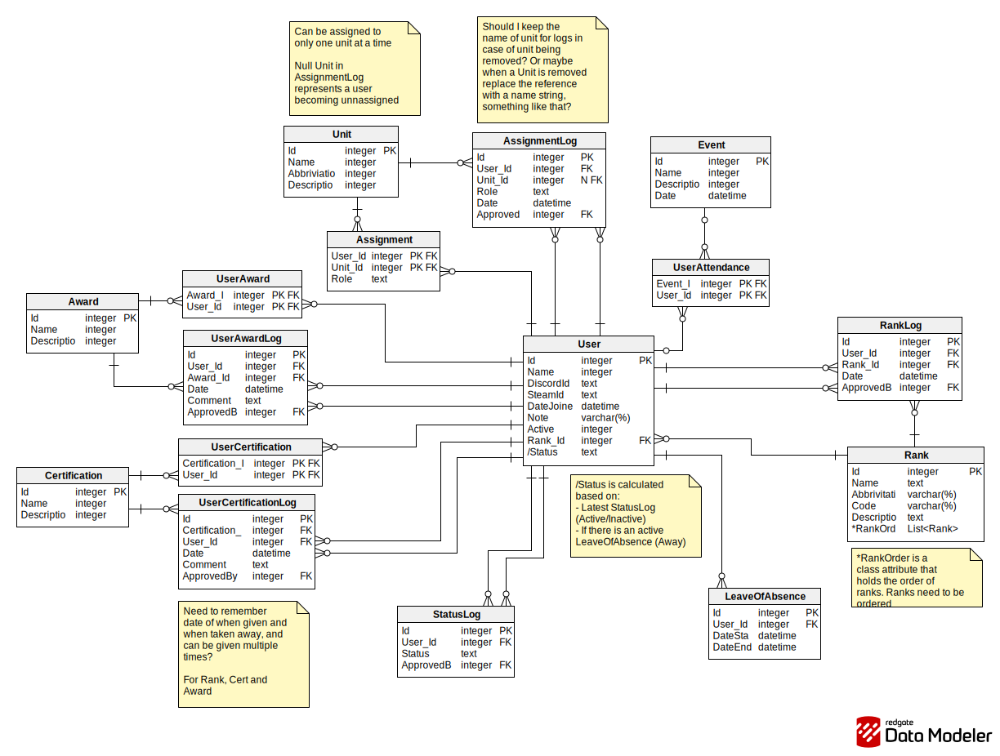

# MilsimManager

#### Hubert Płociński s27049

Web app for managing Arma 3 milsim communities (members, units, ranks, awards, certifications, attendance/events).
The goal is to replace scattered spreadsheets/tools with a single, consistent system for admins and members.

> Academic engineering project (Praca inżynierska).

#### [Figma (Wireframe)](https://www.figma.com/design/vFjFr9PPCNHk5uJG9aM232/s27049-In%C5%BCynierka?node-id=0-1&t=cROPkyiHY8S6ULIx-1)

#### [Figma (Prototype)](https://www.figma.com/proto/vFjFr9PPCNHk5uJG9aM232/s27049-In%C5%BCynierka?node-id=0-1&t=cROPkyiHY8S6ULIx-1)

#### [Documentation (PL)](https://docs.google.com/document/d/1udkuULUKaUg7J7WusQ99-a9FhwgT6Xjgi20UDkHG1Eg/edit?usp=sharing)

## Tech stack

- .NET 8
- Blazor Server (interactive server rendering)
- Entity Framework Core + Npgsql (PostgreSQL provider)
- PostgreSQL
- MudBlazor (UI components)

## Project structure

- `MilsimManager/Models` - EF Core entities (domain model)
- `MilsimManager/Context.cs` - EF Core DbContext
- `MilsimManager/Migrations` - EF Core migrations
- `MilsimManager/Services` - application services (business operations)
- `MilsimManager/Pages` - routeable pages (views)
- `MilsimManager/Components` - reusable UI components and dialogs
- `MilsimManager/Layout` - layout and navigation
- `MilsimManager/wwwroot` - static files (CSS, images)

## Database

PostgreSQL schema is managed by EF Core migrations.

Current database model includes (among others):

- Core: `Users`, `Units`, `Ranks`, `Events`, `Awards`, `Certifications`
- Joins / history: `UserAttendances`, `UserAwards`, `UserCertifications`,
  plus logs like `RankLogs`, `StatusLogs`, `UnitAssignmentLogs`, and `LeaveOfAbsences`.

###### Schema (Prototype)

###### Schema (Current, Generated)

## How to run (local development)

- The Rider run configuration `MilsimManager: http` includes Docker Compose (PostgreSQL) and runs the development
  database seed.
- The `Compose Database` configuration is bundled only with `MilsimManager: http`. If you run `MilsimManager: https` or
  `MilsimManager: IIS Express`, start `Compose Database` separately first.
- Docker Engine must be running (Docker Desktop open).
